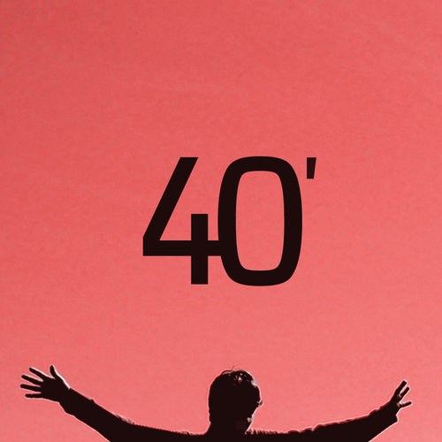

# 40 minutos
## Release
### Para o mundo em “40 minutos”
Minas Gerais se transformou em um tradicional berço de grandes nomes da música popular brasileira. Despontando neste cenário, o jovem músico mineiro Jimmy Andrade acaba de lançar seu segundo álbum, que recebeu o nome de “40 minutos”.

O trabalho conta com 12 faixas, compostas pelo próprio cantor, e está disponível para venda na [Apple Music](https://itunes.apple.com/br/album/40-minutos/id678083980) e na [Google Play Music](https://play.google.com/store/music/album/Jimmy_Andrade_40_Minutos?id=Bpin4665vkodc35pbw42rlseb4a), ou pode ser ouvido no [Spotify](https://play.spotify.com/album/4YZsM60SKtA9R68feMQHdk) e [Deezer](http://www.deezer.com/album/6695875). Com forte algumas influências do disco Sgt. Pepper's, dos Beatles, “40 minutos” é repleto de samples com sons de pássaros, galos cantando, despertadores, vento, chuva e tempestade. 

Segundo Jimmy, o novo álbum foi longamente planejado.

<blockquote>Comecei a pensar no 40 minutos em outubro de 2008, e tinha acabado de conhecer as técnicas de gravação das décadas de 1960 e 1970.</blockquote>

O novo trabalho é a marca do amadurecimento artístico e superação do cantor.

<blockquote>Sou o compositor de todas as músicas, o arranjador e o produtor. Obviamente, contei com ‘uma pequena ajuda dos meus amigos’, essencial em muitos momentos. Mas as vozes e vocais são meus, e cada instrumento foi tocado por mim, seja guitarra e violão, ou as baterias, baixos, pianos e strings, programados eletronicamente.</blockquote>

#### Jimmy Andrade
Henrique Andrade, ou Jimmy Andrade, nasceu na cidade de Minas Novas, no Vale do Jequitinhonha mineiro. Em 2005, se descobriu como cantor. No ano seguinte, ganhou seu primeiro violão e começou a gravar covers. Em 2008, disponibilizou o trabalho "Eletroacústico" na internet. De acordo com o cantor, “o disco era bem caseiro, um mix de composições e covers”. 
O lançamento do primeiro álbum autora, ainda caseiro, “Introspecto” foi em 2009.

Christiano Senna – Jornalista/Assessor de imprensa - [Contato por email](mailto:christianodsenna@yahoo.com.br)

#### Serviço: Jimmy Andrade
* Contato: contato@jimmyandrade.com
* [Canal no YouTube](https://www.youtube.com/user/jimmyandradebr)
* [Twitter](https://twitter.com/jimmyandrade)
* [Spotify](https://open.spotify.com/artist/5cXCuau8jCVmsRoFYj5oGB)
* [Google Play Music](https://play.google.com/store/music/artist/Jimmy_Andrade?id=Avqhy3od6pgogr3e7he4n3in6vi)
* [Apple Music](https://itunes.apple.com/br/artist/jimmy-andrade/id678083982)
* [Deezer](http://www.deezer.com/artist/4899713)

## Capa

